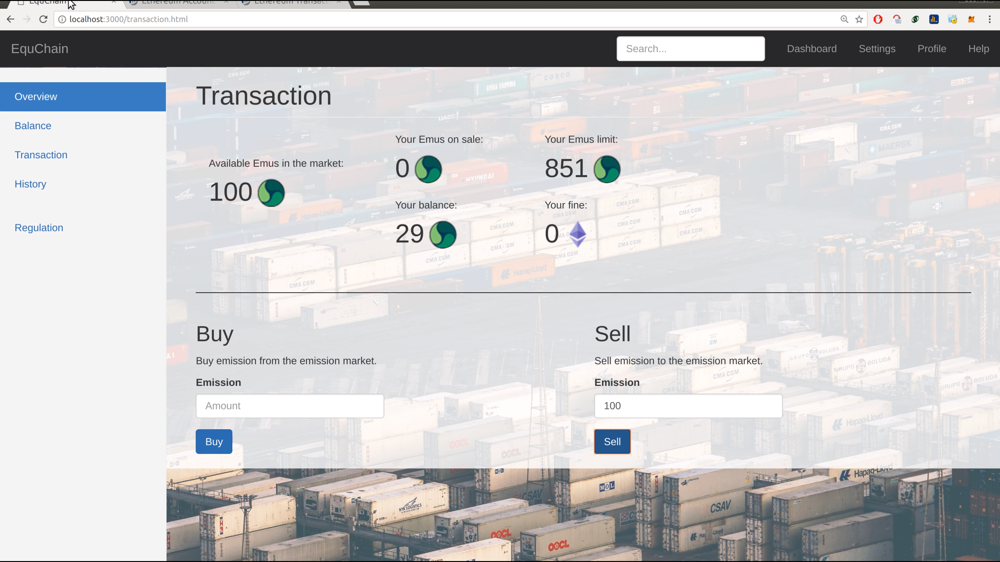

# equchain
Emissions Trading Market are widely considered as one of the first and most successful steps transitioning to clean energies. However, current systems, in Russia, EU, USA, China, etc. rely on manual labor, with the use of regulators and auditors (sources below).  

As a result, emissions trading between companies are tedious, slow and expensive, due to fraud and human errors that cause double spending and increase prices. There are currently several proposals being approved by the EU and USA in order to come up with a better system.

Equchain proposes a blockchain-based system in which the auditors/regulators' role is performed automatically by the smart contract in the ethereum blockchain, hindering tax-evasion, double spending and fraud problems. Our solution is general, but given the different regulations and markets, our case scenario focuses on two of our major partners: the Carbon Emissions trading in California and more specially Emissions trading for companies hosted at the port of Rotterdam.    

Take a look at our (alpha, very alpha) demo video:
https://github.com/Gabbe1993/equchain/blob/master/DEMO1.mkv
